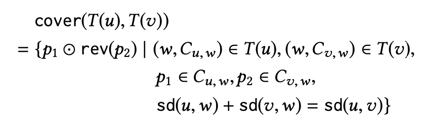
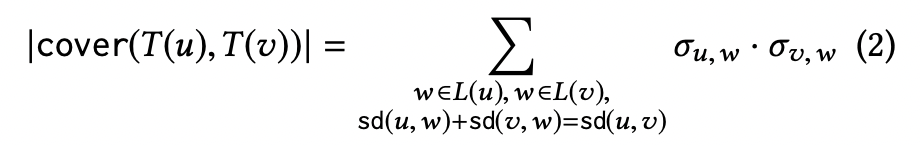
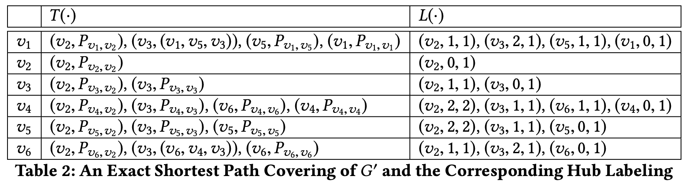

) : entries of the form ), where 

如果采用来进行计算，同一条最短路会被重复计算（该路径上的每个点都会在计数时增加1点贡献），通过构造算法获得)，可以避免这样重复计算的问题

:(w,sd(v,w),\sigma_{v,w})), where 

#### Constructing an ESPC (Exact Shortest Path Covering)

A trough shortest path: 一条最短路且最短路的端点的rank是这条路径上所有节点中最高的

) 和 ): 通过trough shortest path的方式构建的满足ESPC的hub labeling

$\textcolor{violet}{THEOREM~~3.5}$

) is and exact shortest path covering

证明：

即需要证明,T_{\le}(v))) 且 ,T_{\le}(v)))

首先，证明 ,T_{\le}(v))): 

对于中的一条最短路径，设是上rank最高的点，则)在)中，其中，，)在})中，其中，\in C_{v,w})，所以,T_{\le}(v)))，从而,T_{\le}(v)))

然后，证明,T_{\le}(v)))：

由,T(v)))的定义可知，,T_{\le}(v)))只包含间的最短路，由此，需要证明的就是,T_{\le}(v)))中没有重复的最短路，可以用反证法证明。假设在,T_{\le}(v)))中出现了两次，则一定有两个不同点\cap T_{\le}(v))将加入了,T_{\le}(v)))中，假设，但由于也作为了的hub，则，即的rank高于，发生矛盾。所以，证明得到,T_{\le}(v)))中没有重复的最短路，即,T_{\le}(v)))

$\textcolor{lightgreen}{Tips:}$

在证明X是Y时，即证明并且

