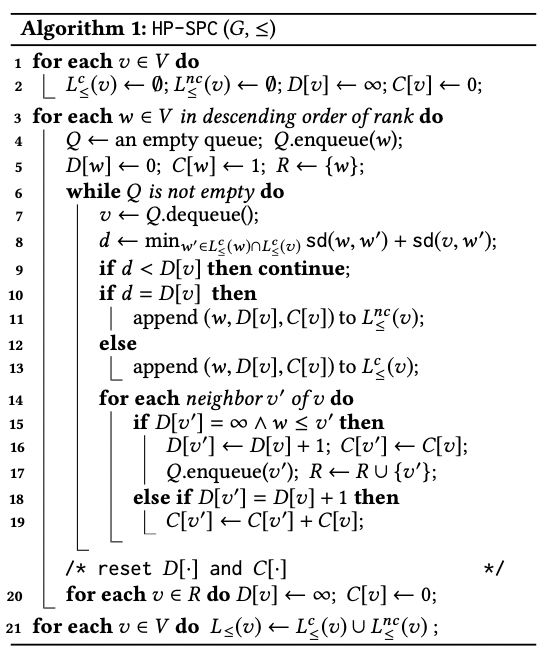

构造算法为每个节点求得$L_{\le}(\cdot)$

#### 算法HP-SPC

**Definition:**

$T^c_{\le}(v):$ 其中的元组$(w,C_{v,w})$满足$C_{v,w}$ 等于$P_{v,w}$, w is a conical hub of v

$T^{nc}_{\le}(v):$ 其中元组$(w,C_{v,w})$满足$C_{v,w}$ 是$P_{v,w}$的一个真子集, w is a non-conical hub of v

当$w$是$P_{v,w}$所涉及的所有节点$Q_{v,w}$中rank最高的节点时，$(w,C_{v,w})\in T^c_{\le}(v)$， 反之，$(w,C_{v,w})\in T^{nc}_{\le}(v)$

**算法大致思路：**

按照rank降序依次遍历每个节点w作为hub，在去除了rank高于w的节点$H_w$之后的图$G_w$上，进行bfs，在bfs的过程中求得w到v的最短距离$D[v]$（不是原图G，而是图$G_w$），令$d$为经过已经加入到$L_{\le}(w)$和$L_{\le}(v)$的hub的$w,v$之间的最短距离($d=\min_{w^{'}\in L_{\le}^c(w)\cap L_{\le}^c{(v)}}sd(w,w^{'})+sd(v,w^{'})$)，如果$d=D[v]$，则将w加入$L_{\le}^{nc}(v)$；如果$d>D[v]$，则将w加入$L^{c}_{\le}(v)$，并且更新v的邻点$v^{'}$到w的最短距离$D[v^{'}]$

**算法解析：**

1.如果$d<D[v]$

可从w到达v：

$D[v]$是在去除$H_w$之后的图上求得的$w,v$之间的最短距离，该最短距离可能大于$v,w$在原图上的最短距离，此时，就对应$d<D[v]$的情况，也就说明，w必须经过rank高于w的节点才能到达v，那么$w$既不属于$L_{\le}^{c}(v)$，也不属于$L_{\le}^{nc}(v)$

从w无法到达v：

自然，$w$既不属于$L_{\le}^{c}(v)$，也不属于$L_{\le}^{nc}(v)$

2.如果$d==D[v]$，说明在当前图$G_w$上存在某些$w,v$在原图上的最短路径，也就是说，$w,v$在原图上的最短路径中，有一部分路径不经过rank高于w的节点，这种情况，$w$属于$L_{\le}^{nc}(v)$

3.如果$d>D[v]$，说明$w,v$之间的最短路都不经过rank高于w的节点，这种情况，$w$属于$L_{\le}^{c}(v)$

伪代码：

$D[v]:$在图$G_w$上$w$到$v$的最短路距离

$C[v]:$在图$G_w$上$w$到$v$的最短路数量

