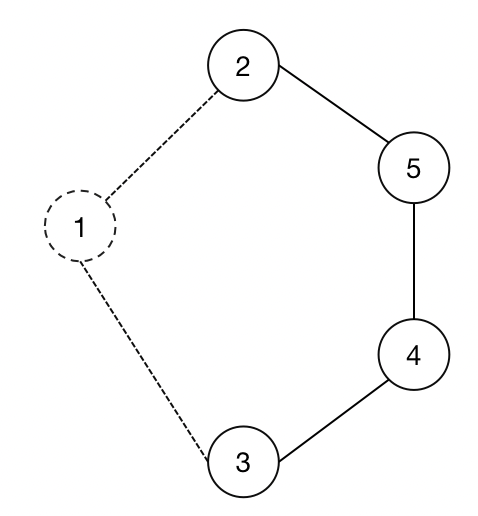
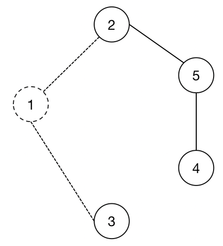
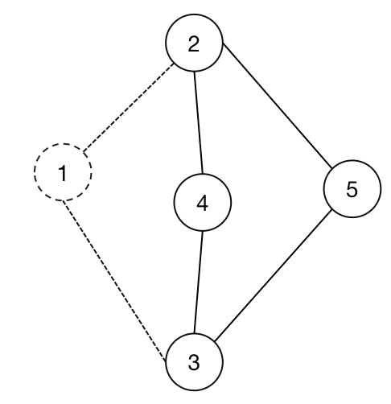
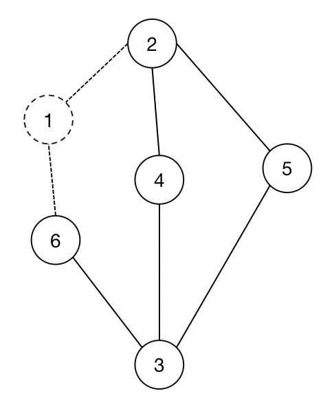

构造算法为每个节点求得)

#### 算法HP-SPC

**Definition:**

:) 其中的元组)满足 等于, w is a conical hub of v

:) 其中元组)满足 是的一个真子集, w is a non-conical hub of v

当是所涉及的所有节点中rank最高的节点时，\in T^c_{\le}(v))， 反之，\in T^{nc}_{\le}(v))

**算法大致思路：**

按照rank降序依次遍历每个节点w作为hub，在去除了rank高于w的节点之后的图上，进行bfs，在bfs的过程中求得w到v的最短距离（不是原图G，而是图），令为经过已经加入到)和)的hub的$w,v$之间的最短距离(\cap L_{\le}^c{(v)}}sd(w,w^{'})+sd(v,w^{'})))，如果，则将w加入)；如果，则将w加入)，并且更新v的邻点到w的最短距离

**算法解析：**

1.如果

可从w到达v：

是在去除之后的图上求得的之间的最短距离，该最短距离可能大于在原图上的最短距离，此时，就对应的情况，也就说明，w必须经过rank高于w的节点才能到达v，那么既不属于)，也不属于)

从w无法到达v：

自然，既不属于)，也不属于)

2.如果，说明在当前图上存在某些在原图上的最短路径，也就是说，在原图上的最短路径中，有一部分路径不经过rank高于w的节点，这种情况，属于)

3.如果，说明之间的最短路都不经过rank高于w的节点，这种情况，属于)

伪代码：

在图上到的最短路距离

在图上到的最短路数量

